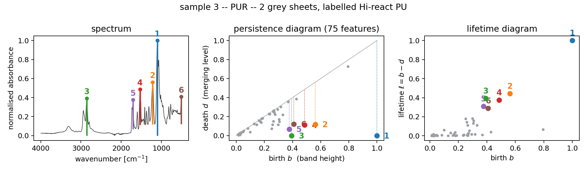
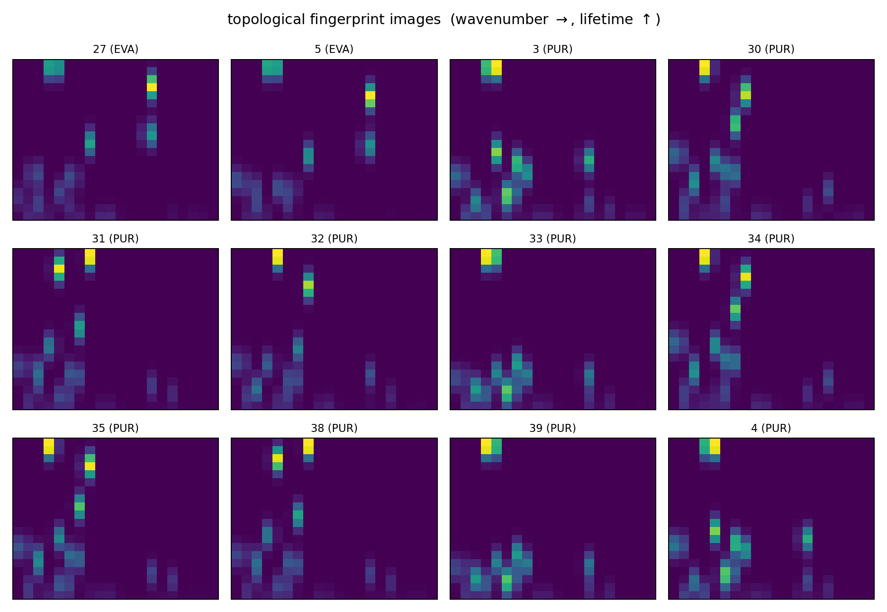
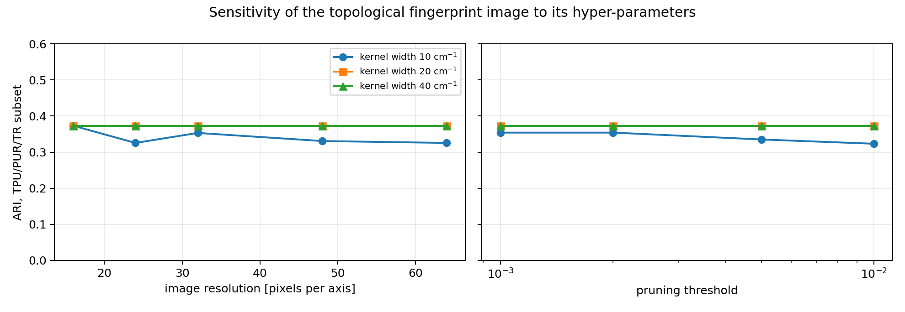
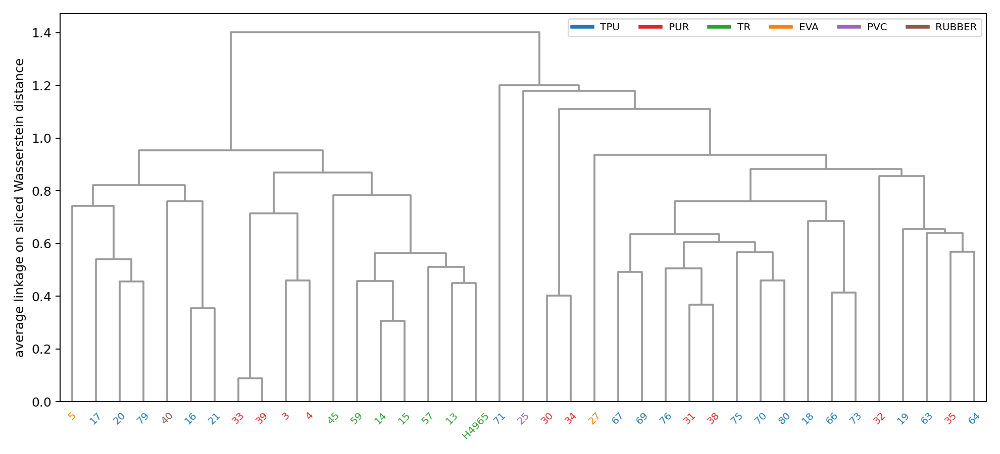
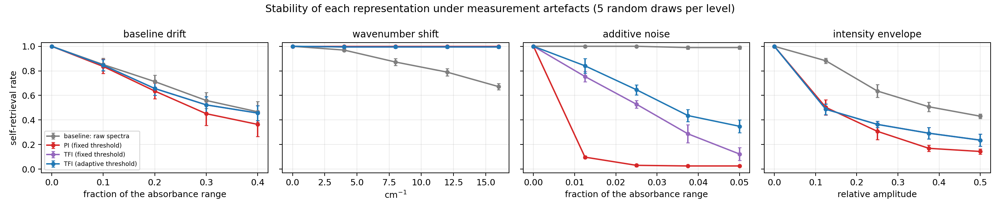
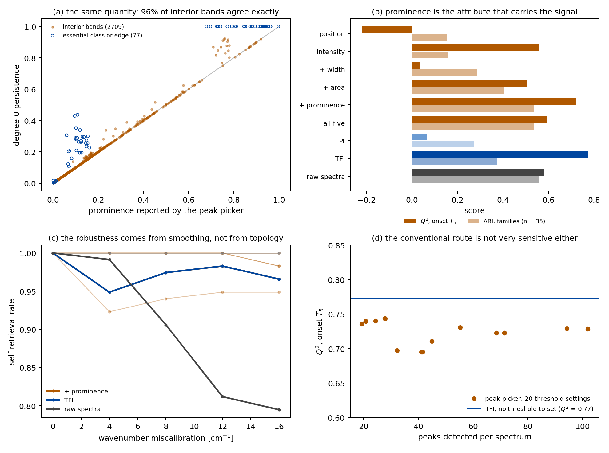
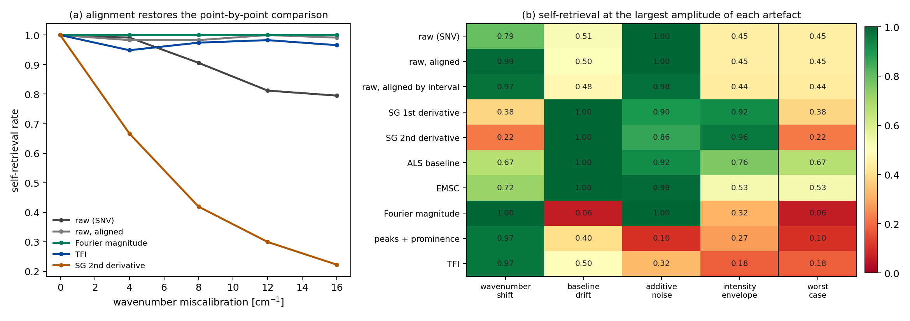
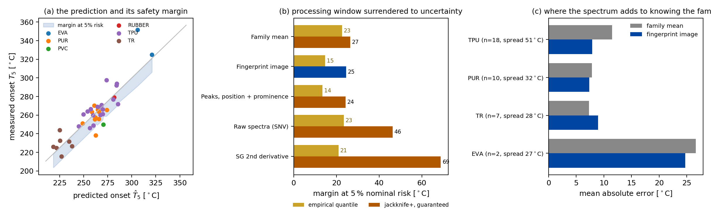
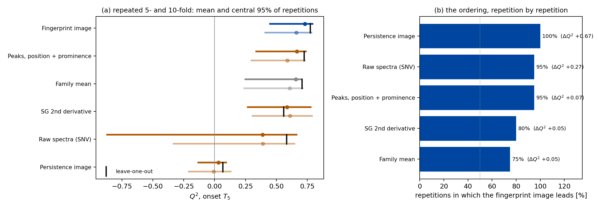
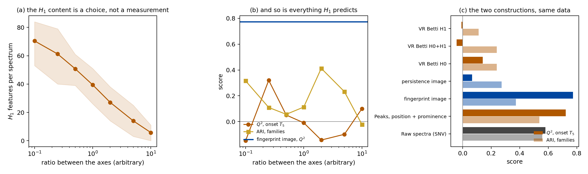

# Topological characterisation of shoe-sole materials from IR/ATR spectra

## 1. Objective

Characterise 39 composite materials from their infrared spectrum using
persistence diagrams, following the methodology of Frahi, Falcó, Chinesta and
co-workers, and establish whether the topological descriptors recover the
material families without being told what they are.

## 2. Data

The source is the results workbook of the study *Caracterización de suelas de
calzado* (Universidad de Alicante, 2021). Each of its 39 worksheets holds the
IR/ATR spectrum of one material reference: about 4 600 points between 499 and
4 000 cm⁻¹, sampled at roughly 0.96 cm⁻¹. Spectra are interpolated onto a
common grid of 3 600 points spanning 500–3 996 cm⁻¹, the range shared by every
worksheet.

The material family is read off the supplier description in
`references.txt`:

| Family | n | Description |
|---|---|---|
| TPU | 18 | thermoplastic polyurethane |
| PUR | 10 | cast / expanded polyurethane |
| TR | 7 | thermoplastic rubber |
| EVA | 2 | ethylene-vinyl acetate |
| PVC | 1 | poly(vinyl chloride) |
| RUBBER | 1 | natural rubber, latex |

The imbalance matters for what follows. Four of the six families have one or two
members, so a clustering can only be scored fairly on TPU, PUR and TR; both the
full set and that 35-sample subset are reported.

ATR absorbance depends on the contact pressure between sample and crystal, so
the absolute scale carries no material information. Spectra are rescaled to
[0, 1] before any topology is computed — persistence values inherit the units of
the filtration function, so this is not cosmetic.

## 3. Method

### 3.1 From a spectrum to a persistence diagram

A spectrum is a function on a line, not a point cloud, and for such a function
the Vietoris–Rips filtration used in the reference papers collapses to something
much simpler. The degree-0 diagram of the superlevel-set filtration is exactly
the "one-to-one local-minimum/local-maximum pairing" of the tape-surfaces paper:
sweep a horizontal line downwards through the spectrum, open a connected
component at every absorption maximum it meets, and close the younger of two
components whenever they merge at a minimum. This is computed in `O(n log n)`
with a union-find structure in `src/irtda/persistence.py`; no external topology
library is required, and the result is exact rather than an approximation on a
subsampled complex.

The reading is directly chemical. Every point of the diagram is one absorption
band; its birth is the band height and **its persistence is the topological
prominence of the band** — how far the absorbance must drop before that band
stops being a separate feature. Shoulders on a strong band appear as
low-persistence points near the diagonal, isolated bands as points far from it.

Diagrams hold about 200 points each, of which roughly 70 survive pruning.
Features whose prominence falls below the noise floor are discarded: the
threshold is the larger of 2·10⁻³ and four standard deviations of the noise,
estimated per spectrum from the median absolute deviation of the second
difference. On this data the noise term never binds — the spectra are clean —
but it becomes decisive in §5.

### 3.2 Two vectorisations

The lifetime diagram `T(a, b) = (a, b − a)` is convolved with an isotropic
Gaussian, weighted by a linear ramp in the lifetime, and integrated over the
cells of a 20 × 20 grid. Pixel values are computed exactly from the Gaussian
CDF rather than by sampling the density at pixel centres, which keeps the
representation stable when the kernel is narrow relative to a pixel.

This gives **PI**, the persistence image of the reference papers. It has a
property worth stating plainly: *the persistence diagram of a one-dimensional
filtration is invariant under any reparametrisation of the domain*. Stretch the
wavenumber axis, or permute whole regions of the spectrum, and the diagram does
not move. For a rough surface profile or a robot trajectory that invariance is
the point. For a vibrational spectrum it discards the single most informative
thing in the measurement, because the position of a band *is* its chemical
identity.

So a second descriptor is introduced here: **TFI**, a *topological fingerprint
image*, built over `(wavenumber, lifetime)` instead of `(birth, lifetime)`. The
horizontal coordinate of each feature becomes the wavenumber of the maximum
that generated it. Prominence — the robust, baseline-insensitive quantity that
persistence supplies — is kept; position is restored.

Diagrams are also compared directly with the sliced Wasserstein distance
(Carrière, Cuturi and Oudot, 2017), which augments each diagram with the
diagonal projections of the other, projects both onto a family of directions and
averages the resulting one-dimensional Wasserstein distances. It is a proper
metric and cheap enough for all 741 pairs. The exact optimal-matching
Wasserstein distance is also implemented, for use on pruned diagrams.

## 4. Unsupervised grouping

Each representation is clustered under an identical protocol and scored against
the material families with the adjusted Rand index (ARI) and adjusted mutual
information (AMI). Both are corrected for chance: 0 means no better than a
random partition. **The labels never enter the clustering.**

| Subset | Representation | ARI | AMI | silhouette |
|---|---|---|---|---|
| all (n=39, k=6) | PI, *k*-means | 0.343 | 0.420 | 0.218 |
| | TFI, *k*-means | 0.332 | 0.460 | 0.336 |
| | sliced Wasserstein, average linkage | 0.305 | 0.396 | 0.229 |
| | baseline: raw spectra, *k*-means | **0.570** | **0.667** | 0.564 |
| TPU/PUR/TR (n=35, k=3) | PI, *k*-means | 0.274 | 0.369 | 0.238 |
| | TFI, *k*-means | 0.373 | 0.515 | 0.356 |
| | sliced Wasserstein, average linkage | 0.285 | 0.282 | 0.289 |
| | baseline: raw spectra, *k*-means | 0.558 | 0.662 | 0.660 |
| | control: peaks, position + prominence | 0.537 | 0.487 | 0.344 |
| | **control: Savitzky–Golay 2nd derivative** | **1.000** | **1.000** | 0.411 |

The last two rows were added by the controls of steps 9 and 10 and change what
the first four mean. Four things are worth reading out of the table.

**TR separates perfectly, and every method finds it.** All seven thermoplastic
rubbers form one cluster containing nothing else, under every representation.
They are the only non-polyurethane family with replicates, and they are
unambiguous.

**The TPU/PUR boundary defeats every topological representation — but not the
chemistry.** Both families are polyurethanes; TPU is the thermoplastic form and
PUR the cast or expanded form of the same chemistry. Their infrared spectra are
dominated by the same N–H, C=O and C–O–C bands. The TFI contingency table

|  | C0 | C1 | C2 |
|---|---|---|---|
| PUR | 0 | 2 | 8 |
| TPU | 0 | 11 | 7 |
| TR | 7 | 0 | 0 |

shows a real but partial separation. The baseline does not separate them either;
it simply splits PUR in two and keeps TPU intact, which happens to score better
without corresponding to a cleaner chemical distinction.

An earlier version of this report concluded from this that the two polyurethanes
are not separable by infrared at all. That was wrong, and the correction is
instructive: overlapping bands are what derivative spectroscopy exists to
resolve. A *k*-means on the second Savitzky–Golay derivative with SNV recovers
the three families with replicates **exactly** — all 18 TPU in one cluster, all
10 PUR in a second, all 7 TR in a third, ARI 1.000. What the separation takes is
a filter that sharpens the shoulders on the shared carbonyl and amide bands, and
neither the absorbance values nor a descriptor built from band prominences
supplies it.

A result that clean on 35 industrial samples invites the suspicion that
something other than chemistry is being recovered, and `10c_confounders.py`
rules the alternatives out. The material family is partly confounded with the
supplier who delivered the batch, but the partition agrees with the family at
1.000 and with the supplier at 0.439 — exactly the agreement the family itself
has with the supplier, so the clustering carries no supplier structure of its
own. Decisively, each family stays intact across the suppliers that delivered
it: TPU from Urban (12) and Pekes (6) in one cluster, PUR from Analco (8) and
Cicasa (2) in another, TR from Pekes (3), Ruiz Alejos (2) and Urban (2) in a
third. A batch effect cannot produce that. Colour is not the driver either —
within the TPU cluster the batches are black, clear, natural and tan, and the
agreement between partition and colour is 0.059. Nor is the result tuned: the
second derivative gives ARI 1.000 over ten of the twelve filter settings tried,
window lengths 7 to 31 and polynomial orders 2 and 3, falling back only at the
widest window, which smooths past a band width. The first derivative does not
separate the polyurethanes at any setting.

**Adding position to the diagram helps, in the way predicted.** On the
TPU/PUR/TR subset the TFI raises the ARI from 0.274 to 0.373 and the AMI from
0.369 to 0.515 over the classical persistence image. The improvement survives
the whole hyper-parameter grid swept in step 5 — pruning threshold 10⁻³–10⁻²,
resolution 16–64 pixels, kernel width 10–40 cm⁻¹ — over which the ARI takes only
two values, 0.373 in 53 of the 60 configurations and 0.278 in the rest. That
insensitivity is itself a result: there is nothing to tune here, and the score
reported above is not the product of a search.

**The raw spectra win on this data set, and a derivative filter wins by more.**
A *k*-means on 3 600 SNV-corrected absorbance values scores 0.56, well above
every topological descriptor; the second-derivative chain scores 1.000. On the
identification task the topological descriptors are simply not competitive, and
we do not claim it for them. §5 explains why the raw spectra do so well here,
and §7 removes the compensating argument this report used to offer.

## 5. Why the baseline wins here, and when it stops winning

All 39 spectra were acquired on one instrument, in one campaign, on one
calibration. They are already aligned to better than the sampling interval and
share a common baseline treatment. Under those conditions a point-by-point
comparison is close to optimal, and the invariances that persistence buys are
invariances to variation this data set does not contain. Reporting that the
baseline wins and stopping there would be measuring the wrong thing.

The claim made for topological descriptors in the reference papers is
specifically about *misalignment*: two signals that describe the same system in
similar conditions never match perfectly, and a metric that requires them to is
fragile. That claim is testable here. Four artefacts routine in ATR practice
were simulated at increasing amplitude — a smooth quadratic baseline drift, a
rigid shift of the wavenumber axis, additive white noise, and a smooth
multiplicative envelope from variable contact pressure. Each perturbed spectrum
is then matched back against the *unperturbed* library by nearest neighbour. The
score is the fraction of spectra that retrieve themselves: no labels are needed,
and it measures precisely whether a representation can still identify a material
after the artefact.

| Artefact, at maximum amplitude | raw spectra | PI | TFI |
|---|---|---|---|
| baseline drift, 0.4 of the absorbance range | 0.48 | 0.39 | 0.46 |
| **wavenumber shift, ±16 cm⁻¹** | **0.68** | **1.00** | **0.99** |
| additive noise, 0.05 of the range | 0.98 | 0.03 | 0.38 |
| intensity envelope, ±50 % | 0.43 | 0.14 | 0.25 |

**The wavenumber shift reverses the ordering completely.** At ±16 cm⁻¹ the raw
spectra identify 68 % of the materials; the persistence image identifies 100 %,
and does so at every amplitude tested, because the diagram is exactly invariant
under reparametrisation of the axis. The TFI holds 99 %: it gives up strict
invariance in exchange for chemical information and loses almost nothing.

This report used to call that a categorical advantage and the regime the method
was designed for. Two qualifications, both established in §7, withdraw the
claim. The stability is not topological — conventional peak descriptors built by
the same vectorisation are equally stable — and the comparison is against a
point-by-point match that has received no treatment, which is not what a
spectroscopist would run.

**Additive noise is where the topological descriptors are genuinely weak.**
Averaging over 3 600 channels suppresses white noise, so the raw spectra barely
notice it; a persistence diagram, by contrast, gains a spurious feature at every
noise-induced local maximum. With a fixed pruning threshold the persistence
image collapses to 3 % self-retrieval at 1.25 % noise. This is a defect of the
threshold, not of the method, and it is worth separating the two: with the
threshold tied to a per-spectrum noise estimate the TFI recovers to 89 % at that
level and 38 % at the highest, against 16 % for the fixed threshold. The
adaptive rule is the default in the library for this reason. Even so, noise
remains the artefact these descriptors handle worst, and a spectrum that is
noisy enough should be smoothed before its topology is computed.

Baseline drift and the intensity envelope fall in between, with the TFI tracking
the baseline closely on the former and both trailing on the latter.

## 6. Is the fingerprint more than a peak table?

The comparisons above are all against absorbance values. That is not the
demanding one. The fingerprint image attaches a prominence to the wavenumber of
each band, and a spectroscopist reaching for the same information would run a
peak picker and tabulate position, intensity, width, area and prominence.
`09_peak_features.py` settles whether persistent homology contributes anything
that table does not already have, at the level of the features rather than by
adding models.

The control is built to differ in one respect only: every conventional
descriptor is a marked point set `(position, attribute)` pushed through the
*same* imager, the same anisotropic kernel, the same resolution and the same ramp
weighting as the fingerprint image.

**The two feature sets are the same set.** At matched thresholds 98.9 % of the
topological features coincide with a detected peak, and on 95.9 % of the 2 709
interior bands the degree-0 persistence equals the reported prominence to
machine precision. This is not a coincidence of these data: topographic
prominence is what degree-0 persistence of a superlevel-set filtration
specialises to on a line. The two part company in exactly two places — the
essential class, which the filtration pairs with min *f* and the peak picker does
not produce at all, and bands whose prominence base runs into the end of the
measured range, where the picker truncates at the array bound and the filtration
continues to the merging saddle.

**Prominence is the attribute that carries the signal.** On the onset of
degradation, position alone predicts nothing (*Q*² = −0.22) and neither width
nor area recovers the property; attaching the prominence reaches 0.72 against
0.77 for the fingerprint image. A paired bootstrap places the fingerprint image
above every control with an interval excluding zero — against position alone
Δ*Q*² = 0.99, intensity 0.21, width 0.83, area 0.36, raw spectra 0.19 — with one
exception. Against position with prominence, Δ*Q*² = 0.051, [−0.054, 0.118],
above zero in 84 % of resamples. The two are not distinguishable.

On identification the conventional route is the better of the two: position with
prominence reaches ARI 0.537 against 0.373. Taken together, what the comparison
establishes is that *prominence at a position* is the representation this problem
wants — demonstrated against the four other conventional attributes with the
vectorisation held fixed — and not that the topological route to it extracts
something the peak table misses. What persistent homology supplies is that
quantity computed exactly, with no detection threshold to choose, and with the
boundary and the global maximum handled by definition rather than by truncation.
Over twenty settings of the picker's thresholds, spanning 19 to 102 detected
peaks per spectrum, its onset *Q*² moves within [0.695, 0.744] and its ARI within
[0.406, 0.537]: a real dependence, and a more modest one than we expected.

## 7. Against the treatment the spectra would actually receive

Every comparison so far is against absorbance values that have received nothing
but an SNV correction. `10_alignment.py` repeats the retrieval experiment with
the chain each artefact calls for: Savitzky–Golay first and second derivatives,
an asymmetric-least-squares baseline followed by SNV, extended multiplicative
scatter correction, a rigid alignment of each query estimated by
cross-correlation, a piecewise alignment in the spirit of interval-correlation-
optimised shifting, and the modulus of the Fourier transform, which is invariant
to a rigid shift by construction.

Alignment is given more than it would have in practice: each query is aligned to
the library spectrum it is compared with, one pair at a time, so every
comparison is made at its own optimal shift. No analyst has that much
information.

| Representation | shift | drift | noise | envelope | worst case |
|---|---|---|---|---|---|
| raw spectra (SNV) | 0.79 | 0.51 | 1.00 | 0.45 | 0.45 |
| raw, aligned rigidly | 0.99 | 0.50 | 1.00 | 0.45 | 0.45 |
| raw, aligned by interval | 0.97 | 0.48 | 0.98 | 0.44 | 0.44 |
| Savitzky–Golay 1st derivative | 0.38 | 1.00 | 0.90 | 0.92 | 0.38 |
| Savitzky–Golay 2nd derivative | 0.22 | 1.00 | 0.86 | 0.96 | 0.22 |
| ALS baseline + SNV | 0.67 | 1.00 | 0.92 | 0.76 | **0.67** |
| EMSC | 0.72 | 1.00 | 0.99 | 0.53 | 0.53 |
| Fourier magnitude | 1.00 | 0.06 | 1.00 | 0.32 | 0.06 |
| peaks, position + prominence | 0.97 | 0.40 | 0.10 | 0.27 | 0.10 |
| fingerprint image | 0.97 | 0.50 | 0.32 | 0.18 | 0.18 |

The table does not support the claim §5 was written to make. Aligning the query
restores the point-by-point comparison to 0.99 at ±16 cm⁻¹, and the Fourier
magnitude reaches 1.00 at every amplitude, against 0.97 for the fingerprint
image. Under a baseline drift the derivative and baseline-correction chains
retrieve every material at every amplitude while the fingerprint image falls to
0.50: degree-0 persistence is invariant to an additive constant, not to a curved
drift, and a baseline correction removes the drift outright. Under noise and
under a variable contact pressure the topological descriptors are the weakest of
all. **The general claim of robustness is not sustainable, and we withdraw it.**

What survives is narrower. No single conventional chain is uniformly good: the
second derivative is perfect against a drift and a contact-pressure envelope and
collapses to 0.22 under a miscalibration, while the Fourier magnitude does the
reverse. Each is the right answer to the artefact it was chosen for, and
choosing it requires knowing which artefact is present. The band-based
descriptors need no such choice — but with a worst case of 0.18 they are not the
representation to reach for when the artefact is unknown either. On this
evidence the honest recommendation for a library assembled across instruments is
an alignment step or a baseline correction, chosen for the acquisition
conditions at hand.

## 8. From a coefficient of determination to a moulding decision

A *Q*² is not a processing statement. What a converter needs from the onset is
the highest temperature at which a compound can be formed without beginning to
decompose, and what a predictor of it is worth is measured in degrees of usable
processing window. `11_moulding_window.py` and `12_conformal_margin.py` make the
translation.

The admissible temperature is the predicted onset less a margin that absorbs the
prediction error. Taking that margin as an empirical quantile of the
leave-one-out residual does not work at this sample size: asked for a 5 % risk of
over-heating it delivers 7.7 %, and asked for 1 % it delivers 5.1 %. The tail is
estimated from two or three points. Replacing it with the one-sided jackknife+
bound of Barber, Candès, Ramdas and Tibshirani (2021), which guarantees
P(*T*₅ > *L*(*x*)) ≥ 1 − 2α in finite samples with no assumption on the residual
distribution or on the regression method, brings the realised risk to 2.6 % —
one compound of 39 — for every representation.

| Representation | mean abs. error | empirical quantile | realised | jackknife+ | realised |
|---|---|---|---|---|---|
| family mean | 10.8 °C | 22.6 | 7.7 % | 26.5 | 2.6 % |
| raw spectra (SNV) | 11.4 °C | 23.4 | 5.1 % | 46.3 | 0.0 % |
| Savitzky–Golay 2nd derivative | 10.1 °C | 21.1 | 7.7 % | 68.9 | 2.6 % |
| peaks, position + prominence | **8.9 °C** | 13.5 | 7.7 % | **24.3** | 2.6 % |
| fingerprint image | 9.0 °C | 14.7 | 7.7 % | 24.6 | 2.6 % |

A paired bootstrap puts the margin returned by the fingerprint image over the
family mean at 1.96 °C, [1.08, 2.86], above zero in every resample. **Two
degrees of moulding temperature, certified**, is what a spectrum buys over
knowing the polymer class — less than the eight the uncalibrated rule suggested,
and unlike it a number that can be relied on. Applying the rule over process
temperatures from 210 to 315 °C, the decision is correct 85.8 % of the time
against 80.4 % for the family mean; the class-only rule never admits a compound
that degrades but needlessly rejects 168 compound–temperature pairs against 117.

Two further observations. The second-derivative chain has the second best
typical error and by far the worst certified margin, because the margin is set by
the lower tail of the residual: identification and prediction are not won by the
same representation, and a pre-processing chain chosen on identification
performance would be the wrong choice here. And the gain is concentrated where
the construction predicts — largest for TPU, the family with the widest internal
spread of onset (51.5 °C), where the mean absolute error falls from 11.5 to
7.9 °C; marginal for PUR; negative for TR, whose members differ little. The
descriptor separates *formulations within a polymer class*, not classes from each
other, which is also the task §4 shows it loses.

One limit is worth recording rather than burying. The jackknife+ bound needs the
⌊α(*m*+1)⌋-th order statistic of *m* = 38 candidates; at α = 0.025 that index is
zero, so the bound degenerates to the smallest candidate. A distribution-free
5 % guarantee needs α ≥ 1/39, a nominal risk of 5.1 %: this data set is one
compound short of certifying the figure it is asked for, and every jackknife+
margin above is the most conservative the construction can give.

A permutation test settles the prior question. Permuting the onsets and
repeating the whole leave-one-out procedure 300 times, the fingerprint image
reaches *Q*² = 0.773 against a null whose 95th percentile is −0.011, *p* = 0.003
— the smallest value 300 permutations can return. Whatever the descriptors are
reading, it is not noise.

## 7b. How much of the reported *Q*² is the partition?

`14_repeated_cv.py` asks what a single number hides at *n* = 39.

The seed of the inner loop that selects the number of PLS components leaves the
ridge figures untouched — the penalty is chosen by a deterministic internal
criterion — while the PLS figures move over twenty seeds: the fingerprint image
by ±0.017, the raw spectra by ±0.065, the classical persistence image by ±0.107.
Every headline value in this report is a ridge value.

Leave-one-out itself is the low-bias, high-variance end of the choice. Repeating
an outer *k*-fold twenty times:

| Representation | leave-one-out | 5-fold | 10-fold |
|---|---|---|---|
| fingerprint image | **0.773** | **0.661 ± 0.134** | **0.730 ± 0.101** |
| peaks, position + prominence | 0.723 | 0.588 ± 0.148 | 0.666 ± 0.118 |
| family mean | 0.706 | 0.608 ± 0.186 | 0.657 ± 0.142 |
| Savitzky–Golay 2nd derivative | 0.557 | 0.610 ± 0.167 | 0.586 ± 0.138 |
| raw spectra (SNV) | 0.581 | 0.390 ± 0.320 | 0.387 ± 0.476 |
| persistence image | 0.066 | −0.008 ± 0.109 | 0.030 ± 0.070 |

Leave-one-out is optimistic relative to *k*-fold on the same data, and the
central 95 % of repetitions for the fingerprint image spans [0.40, 0.79] — an
interval that overlaps every other row, so read marginally the ranking is not
resolved. The raw spectra are worse than that: σ = 0.32 at *k* = 5 and 0.48 at
*k* = 10, dipping below −0.8 on some partitions. A representation that unstable
is not a usable baseline whatever its mean.

The comparisons, though, are paired — the same partition scores every
representation — and paired they are far better resolved. Across the twenty
repetitions the fingerprint image leads the persistence image in 100 %, the raw
spectra in 95 %, a peak table with prominence in 95 %, the second-derivative
chain in 80 %, and the family mean in 75 %. That last figure puts a number on
the reservation §5 states in words: the fingerprint image extracts the onset
better than the absorbance values do, and whether it does so beyond identifying
the material family remains suggestive at this sample size.

## 8b. The Vietoris–Rips pipeline, on the same data

§3.1 argues for the lower-star filtration against the Vietoris–Rips construction
that Conti *et al.* (2023) prefer, and argues it by construction. An argument by
construction is not evidence. `13_rips_comparison.py` implements their pipeline
— each spectral sample a point of the plane, a Vietoris–Rips filtration, Betti
curves — and runs it on these 39 compounds.

**The parameter the comparison turns on.** A planar point cloud needs a metric,
and the axes of a spectrum carry different units, so the distance between two
samples depends on a ratio between wavenumber and absorbance that nothing in the
measurement fixes. Sweeping it over two orders of magnitude, the number of *H*₁
classes per spectrum falls from 70.5 to 5.7 — a factor of twelve — and
everything those classes predict moves with it: *Q*² on the onset spans
[−0.147, 0.320] and the ARI [−0.021, 0.413].

| Representation | *Q*² (*T*₅) | ARI | AMI |
|---|---|---|---|
| Vietoris–Rips, Betti *H*₁ | −0.009 | 0.113 | 0.197 |
| Vietoris–Rips, Betti *H*₀+*H*₁ | −0.042 | 0.240 | 0.369 |
| Vietoris–Rips, Betti *H*₀ | 0.142 | 0.240 | 0.369 |
| Lower-star, persistence image | 0.066 | 0.274 | 0.369 |
| Lower-star, fingerprint image | **0.773** | 0.373 | **0.515** |
| Peaks, position + prominence | 0.723 | **0.537** | 0.487 |
| Raw spectra (SNV) | 0.581 | **0.558** | **0.662** |

At the natural choice of ratio the Betti curve of *H*₁ predicts the onset not at
all, and concatenating it with *H*₀ makes the prediction worse than *H*₀ alone.
Part of the loss is the vectorisation rather than the filtration: a Betti curve
is a function of the filtration value alone and discards where along the
spectrum anything happened — the same loss §3.2 identifies in the classical
persistence image and the TFI repairs.

**And what it costs.** The lower-star sweep runs on all 3 600 channels in 4.6 ms
per spectrum. Vietoris–Rips is quadratic in memory before it is anything else,
so the spectrum must be subsampled at all: 0.50 s at 600 points, 108× the cost,
and 2.16 s at 1 000. The subsampling discards precisely the fine structure —
shoulders on strong bands — that a lower-star prominence records exactly.

The same choice is made elsewhere and paid for the same way. Yu and Chen (2026)
also decline the lower-star filtration for mid-infrared spectra, reaching a
point cloud by a time-delay embedding of sliding windows (*m* = 2, τ = 1) before
applying Vietoris–Rips; the window length and the two embedding parameters are
free in exactly the way the axis ratio is, and the authors note the
approximately quadratic dependence on the number of embedded points that
follows. Their data are the six FTIR benchmarks of the UCR archive rather than a
campaign with an independently measured property, so no comparison of results is
drawn — the point of contact is that every route to a Vietoris–Rips complex
introduces parameters the measurement does not determine, and the lower-star
filtration introduces none.

The disagreement is therefore settled on these data, in favour of the lower-star
construction. Their objection is correct as stated — a lower-star filtration
produces no *H*₁ for a 1-D signal — but for a vibrational spectrum that costs
nothing, because the *H*₁ a Vietoris–Rips complex supplies in its place is a
function of an arbitrary parameter and carries no signal about either property
measured here. Whether the same holds for their Raman data, with a different
task and instrument, these data cannot say.

## 9. Conclusions

1. The persistent-homology workflow of Frahi *et al.* transfers to IR spectra
   with a considerable simplification: for a one-dimensional filtration the
   degree-0 diagram is an exact union-find computation, and the Rips machinery
   is unnecessary.
2. Persistence of a feature reads as the prominence of an absorption band,
   which makes the descriptor interpretable rather than merely predictive.
3. The classical persistence image discards band positions, and for
   spectroscopy that is the wrong invariance. The position-aware variant
   proposed here (TFI) raises the ARI from 0.27 to 0.37 on the polyurethane /
   rubber subset and is insensitive to its hyper-parameters. What the restored
   position buys is a band prominence located on the wavenumber axis; a
   conventional peak table carrying the same two quantities performs the same.
4. Persistent homology and a peak picker return the same quantity. Degree-0
   persistence of a superlevel-set filtration is topographic prominence, and on
   96 % of interior bands the two agree to machine precision. What the
   filtration adds is that the quantity is obtained exactly, without a detection
   threshold, and with the boundary and the global maximum handled by
   definition — not information the peak table lacks. Among the conventional
   attributes, prominence is the one that carries the signal.
5. On clean, single-instrument data the raw spectra remain the stronger
   representation, and a second-derivative chain is stronger still. The
   robustness that this report previously offered in compensation does not hold:
   aligning the query restores the point-by-point comparison under a
   miscalibration, and across the four artefacts a baseline correction has the
   best worst case (0.67) and the fingerprint image nearly the worst (0.18). We
   claim no general robustness.
6. TR is cleanly separable from the polyurethanes by every method. **TPU and PUR
   are separable too, and by infrared**: a second Savitzky–Golay derivative
   recovers the three families with replicates exactly, stable over the filter
   settings and attributable neither to the supplier nor to the colour of the
   batches. The earlier conclusion that their shared chemistry makes them
   indistinguishable was a limitation of the representations tried, not of the
   measurement.
7. Expressed as a processing decision with a margin that carries a finite-sample
   guarantee, the onset prediction is worth about two degrees of moulding
   temperature over knowing the polymer class — 1.96 °C, [1.08, 2.86] — and the
   resulting decision is right 85.8 % of the time against 80.4 %. The gain is
   concentrated in TPU, the family whose onset varies most between grades: the
   descriptor separates formulations within a class rather than classes from one
   another.

## 10. Limitations and next steps

- **39 samples, one spectrum each.** No replicates, so within-material
  variability cannot be estimated and supervised classification is not
  meaningful. The tape-surfaces paper had 800 profiles from 16 surfaces; the
  analogous move here is to acquire several spectra per reference, which would
  also allow the sliding-window protocol of the driver-assistance paper.
- **The families are inferred from free-text supplier descriptions**, not from
  independent chemical analysis. The workbook also contains thermogravimetric
  and EGA/Py/GC/MS results that could confirm them, and that this analysis does
  not touch.
- **Only degree-0 homology is used.** Embedding the spectrum as a point cloud
  in the plane, or by time-delay embedding, would give H₁ features; whether
  loops in such an embedding carry chemical meaning is an open question.
- **Multi-modal fusion adds nothing here.** Persistence diagrams of the DTG
  curve concatenated with the spectral ones reproduce the DTG partition exactly
  and are slightly worse on the full set. The motivation for trying it — that
  infrared alone cannot separate TPU from PUR — has in any case been withdrawn.
- **The reference set is one compound short of a distribution-free 5 %
  guarantee.** The jackknife+ margin needs the ⌊α(*m*+1)⌋-th order statistic of
  *m* = 38 candidates, which at α = 0.025 does not exist. A modestly larger set
  would tighten every margin reported in §8.
- **A follow-up that would test the mechanism.** §8 attributes the gain to the
  prominence of bands belonging to the labile fraction, which varies between
  grades of one polymer while the backbone does not. A campaign acquiring a
  series of TPU grades of one base polymer with controlled plasticiser content,
  with replicate spectra per grade and thermogravimetry on the same specimens,
  would confirm or refute it.

## References

1. T. Frahi, C. Argerich, M. Yun, A. Falcó, A. Barasinski, F. Chinesta.
   *Tape surfaces characterization with persistence images*.
   AIMS Materials Science 7(4):364–380, 2020.
2. T. Frahi, F. Chinesta, A. Falcó, A. Badias, E. Cueto, H. Y. Choi, M. Han,
   J.-L. Duval. *Empowering Advanced Driver-Assistance Systems from Topological
   Data Analysis*. Mathematics 9:634, 2021.
3. T. Frahi, A. Falcó, B. Vinh Mau, J. L. Duval, F. Chinesta. *Empowering
   Advanced Parametric Modes Clustering from Topological Data Analysis*.
   Applied Sciences 11:6554, 2021.
4. T. Frahi, A. Sancarlos, M. Galle, X. Beaulieu, A. Chambard, A. Falcó,
   E. Cueto, F. Chinesta. *Monitoring Weeder Robots and Anticipating Their
   Functioning by Using Advanced Topological Data Analysis*.
   Frontiers in Artificial Intelligence 4:761123, 2021.
5. M. Carrière, M. Cuturi, S. Oudot. *Sliced Wasserstein Kernel for Persistence
   Diagrams*. ICML, 2017.
6. I. Blasco López, A. F. Marcilla Gomis. *Caracterización de suelas de
   calzado*. Informe final, Universidad de Alicante, 2021.
7. P. Virtanen *et al.* *SciPy 1.0: fundamental algorithms for scientific
   computing in Python*. Nature Methods 17:261–272, 2020.
   doi:10.1038/s41592-019-0686-2 — the peak picker used as the control in §6.
8. P. H. C. Eilers, H. F. M. Boelens. *Baseline correction with asymmetric
   least squares smoothing*. Technical report, Leiden University Medical
   Centre, 2005 — the baseline correction of §7.
9. H.-C. Yu, Y.-K. Chen. *Improved FTIR-based classification for food
   authentication using a topological ensemble framework*. Current Research in
   Food Science 12:101441, 2026. doi:10.1016/j.crfs.2026.101441 — the
   time-delay-embedding route to Vietoris–Rips discussed in §8b.
10. R. F. Barber, E. J. Candès, A. Ramdas, R. J. Tibshirani. *Predictive
   inference with the jackknife+*. The Annals of Statistics 49(1):486–507,
   2021. doi:10.1214/20-AOS1965 — the certified margin of §8.
